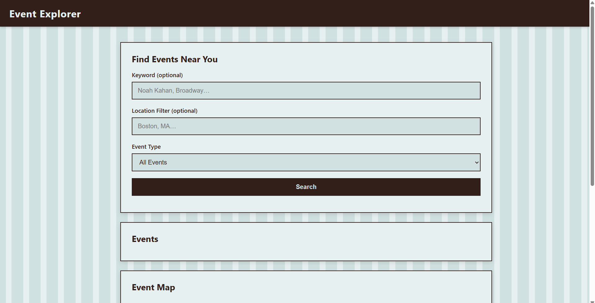

# Ticketmaster Event Explorer

## What It Does
- This repo contains all the files needed to run Ticketmaster Event Explorer, a fully client-side event discovery tool. It includes a search interface for finding events by keyword/location/category, an interactive map view, and event display cards. Users can search Ticketmaster's database for concerts, sports games, and other live events, view them on a map, and see key details about each event.

## API Used
[Ticketmaster Discovery API](https://developer.ticketmaster.com/products-and-docs/apis/discovery-api/v2/)

## Live Site
[View Live Demo](https://ticketmaster-event-tracker.vercel.app/index.html)

